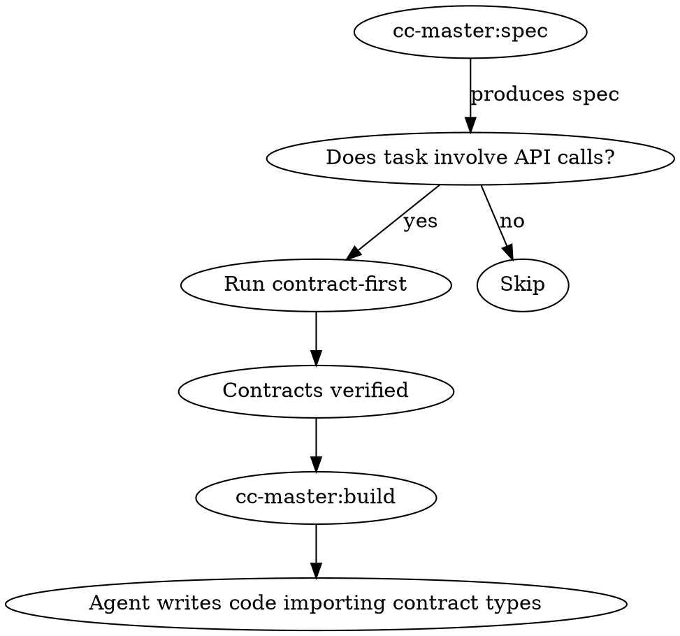

# cc-master:contract-first — Verified Contracts Before Code

Never write client code that calls a server endpoint without first reading the server's actual source code and producing a verified contract. This skill is a mandatory pre-build gate for any task that crosses a service boundary.

## Why This Exists

Every integration bug traces to the same root cause: the client developer guessed the API shape instead of reading the server source. Common failures:
- Wrong URL path (nginx rewrites not accounted for)
- Wrong parameter names or values (`groupBy: 'daily'` when server only accepts `'day'`)
- Wrong response shape (nested wrapper objects assumed to be flat arrays)
- Wrong field casing (snake_case from DB vs camelCase from serializer)
- Endpoint doesn't exist at the path assumed

**The fix:** Read the actual server handler, trace through the routing/proxy layer, document the exact contract, THEN write the client code.

## When This Runs



**Trigger:** Any spec or build task that lists API endpoints, HTTP calls, or service-to-service communication.

**Blocks:** No client code may be written for an endpoint until its contract is verified and documented.

## The 5-Step Contract Trace

For EVERY endpoint a client will call:

### Step 1: Find the Server Handler

Search the server codebase for the route definition. Framework-specific patterns:

| Framework | Search For |
|-----------|-----------|
| Dropwizard/Jersey | `@Path("...")` class + `@GET`/`@POST` method annotations |
| Vert.x | `router.get("/path")`, `router.route("/path")`, `mountSubRouter()` |
| Express/Koa | `app.get()`, `router.get()`, `app.use('/prefix', router)` |
| Spring Boot | `@RequestMapping`, `@GetMapping`, `@PostMapping` |
| FastAPI | `@app.get("/path")`, `@router.post("/path")` |
| Django REST | `urlpatterns`, `@api_view`, ViewSet `queryset` |
| Go net/http | `http.HandleFunc()`, `mux.HandleFunc()`, `gin r.GET()` |

**Read the actual file.** Do not guess from file names, directory structure, or documentation.

### Step 2: Trace the Routing/Proxy Layer

Map the full path from client to server:

```
Client URL → Reverse proxy (nginx/Caddy/ALB/Traefik) → Server context path → Handler path
```

**Check for:**
- Reverse proxy `location` blocks with `proxy_pass` — does it strip or add path prefixes?
- Server application context path (`server.applicationContextPath` in Dropwizard, base URL in Express)
- Sub-router mounts that add prefixes
- Trailing slash behavior (nginx `alias` requires matching trailing slashes)

**Write the full chain:**
```
Frontend: /api/v1/registrar/portfolio/expiring
  → nginx: location /api/v1/registrar/ → proxy_pass http://registrar:8085/registrar-service/
  → backend: rootPath /registrar-service → @Path("/portfolio") → @Path("/expiring")
```

### Step 3: Document Parameters

Read every parameter annotation on the server handler:

| Annotation Type | Example | What to Record |
|----------------|---------|---------------|
| Query param | `@QueryParam("days") @DefaultValue("30") @Min(1) @Max(365)` | name, type, default, validation constraints |
| Path param | `@PathParam("id")` | name, type, position in URL |
| Request body | Method parameter with `@Valid` or no annotation | Full DTO class with field names and types |
| Headers | `@HeaderParam("X-Custom")` | name, required/optional |

**For request body DTOs:** Read the class definition. Record every field name, type, and validation annotation (`@NotNull`, `@NotEmpty`, `@Size`, `@Pattern`).

### Step 4: Trace the Response Shape

Follow the return path: Handler → Service → DAO/Repository → SQL → back through serialization.

**Critical questions:**
- What Java/Python/Go type does the handler return?
- Does the serializer (Jackson/Gson/Pydantic) use default field naming or overrides?
- Is there a global naming strategy (`PropertyNamingStrategies.SNAKE_CASE`)?
- Are there `@JsonProperty("wire_name")` overrides on individual fields?
- Is the response wrapped? (`{ data: [...] }`, `{ items: [], total: N }`, `{ circuitBreakers: [...] }`)
- For collections: is it a flat array or paginated envelope?

**Check for response transformers in the pipeline:**
- Middleware that converts all responses to snake_case or camelCase
- Admin-specific transforms (e.g., `toCamelCaseKeys()` applied to admin endpoints only)
- Vert.x `JsonObject` with `.mapTo()` or `.encode()` — field names match the Java property names

### Step 5: Write the Verified Contract

Create a contract file in the client project. Format (TypeScript example — adapt for other languages):

```typescript
/**
 * GET /registrar/portfolio/expiring
 *
 * Verified: <date> against PortfolioResource.java:<line>
 * Nginx: /api/v1/registrar/ → /registrar-service/
 * Frontend path: /registrar/portfolio/expiring
 */

// --- Request ---
export interface ExpiringParams {
  /** @QueryParam("days") @DefaultValue("30") @Min(1) @Max(365) */
  days?: number
}

// --- Response: Domain[] (Jackson camelCase) ---
export interface ExpiringDomain {
  domainId: string
  domainName: string
  status: string
  expiresAt: string   // ISO timestamp
  autoRenew: boolean
}
```

For Python:
```python
@dataclass
class ExpiringDomain:
    """GET /registrar/portfolio/expiring
    Verified: <date> against PortfolioResource.java:<line>
    """
    domain_id: str
    domain_name: str
    status: str
    expires_at: str
    auto_renew: bool
```

For Go:
```go
// GET /registrar/portfolio/expiring
// Verified: <date> against PortfolioResource.java:<line>
type ExpiringDomain struct {
    DomainID   string `json:"domainId"`
    DomainName string `json:"domainName"`
    Status     string `json:"status"`
    ExpiresAt  string `json:"expiresAt"`
    AutoRenew  bool   `json:"autoRenew"`
}
```

## Integration with cc-master Pipeline

### In cc-master:spec

When a spec lists API endpoints:
1. For each endpoint, run the 5-step trace
2. Write contract types into the spec under `### Verified Contracts`
3. Include the backend source file and line number
4. If the endpoint doesn't exist or parameters don't match — flag it NOW, don't proceed to build

### In cc-master:build

Before any build agent writes client code:
1. Check if a verified contract exists for every endpoint the component calls
2. If missing: STOP. Run the 5-step trace first.
3. Client code MUST import types from the contract file — not define ad-hoc inline interfaces
4. No `unknown`, `any`, or untyped responses allowed

### After cc-master:build

Run `cc-master:api-contract` as the verification gate to confirm nothing drifted during implementation.

## Red Flags — STOP and Trace

| Red Flag | What To Do Instead |
|----------|-------------------|
| Copying an API path from existing client code | Existing client code may have the same bugs. Verify against server source. |
| Writing `client.get('/some/path')` without reading the handler | Find the `@Path`/`router.get()`. Trace through proxy layer. |
| Using `unknown` or `any` for response types | Read the server return type. Write the typed interface. |
| Assuming camelCase or snake_case | Check serializer config. Check for `@JsonProperty` overrides. Check for global transformers. |
| Using a response type from a spec or doc | Specs drift. Server source is truth. |
| "It's probably a flat array" | Check. Wrapped responses (`{items:[], total}`, `{data:{pools:[]}}`) are common. |
| "The parameter is probably called X" | Read the `@QueryParam`/`@RequestParam` annotation. Exact spelling matters. |
| Trusting another project's client code | That client may have the same integration bugs. Always verify against server source. |

## Build Verification

Every client project build must use the strictest available compiler mode:

| Language | Strict Build | NOT Sufficient |
|----------|-------------|---------------|
| TypeScript | `tsc -b` (project build) | `tsc --noEmit` (misses strict project-ref errors) |
| Python | `mypy --strict` | `mypy` without strict flag |
| Go | `go vet ./...` + `staticcheck` | `go build` alone |
| Rust | `cargo clippy -- -D warnings` | `cargo build` alone |
| Java/Kotlin | Full `mvn compile` with `-Werror` | IDE-only compile check |

## What NOT To Do

- Do NOT trust documentation, specs, or OpenAPI files as source of truth — they drift
- Do NOT trust existing client code in the same or other projects — it may have the same bugs
- Do NOT write client code first and "verify later" — bugs are cheaper to prevent than find
- Do NOT skip the proxy layer trace — path rewriting is the #1 source of 404 bugs
- Do NOT assume all endpoints in a service use the same serialization strategy
- Do NOT create tasks without contracts — the contract IS the spec for the integration layer
